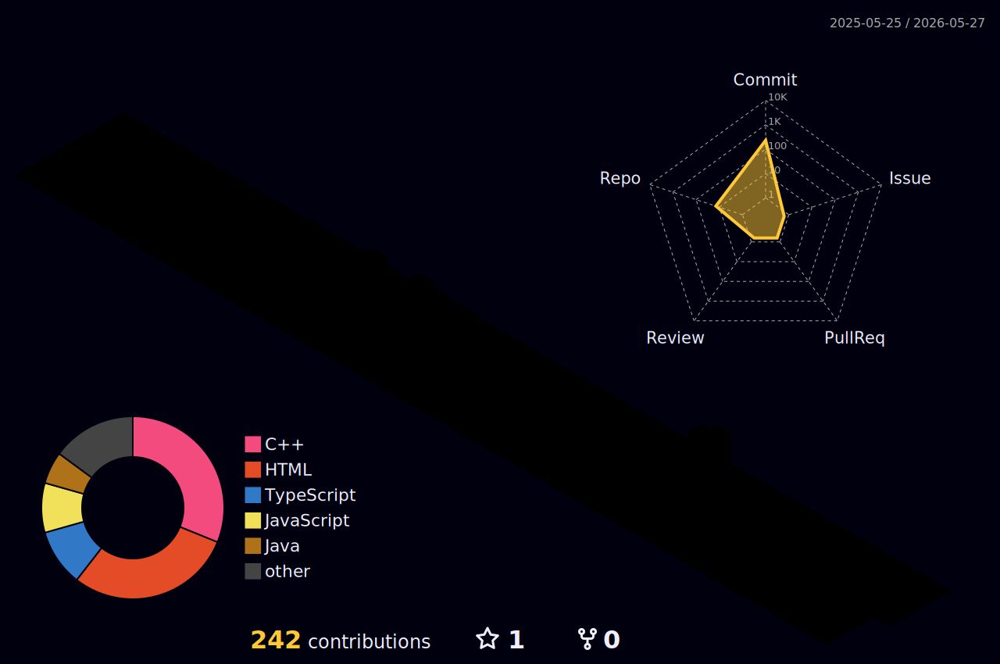

🚀 Building with Node.js, Express & MongoDB &nbsp;|&nbsp; 🌱 Exploring DSA, Web Dev & AI &nbsp;|&nbsp; ☕ Coffee-powered coder

Turning ideas into code, one debug session at a time. Always learning, always shipping. ✨

 

<h3 align="left">🔭 What I'm working on</h3>

Currently building out backend services in Node.js/Express — wiring up MongoDB Atlas, handling file uploads with ImageKit, and getting comfortable with the messy real-world parts of backend dev (connection errors, auth, error handling).

<h3 align="left">🌐 Connect with me</h3>

<h3 align="left">🛠️ Languages & Tools</h3>

<b>Languages</b>

<b>Frontend</b>

<b>Backend</b>

<b>Databases</b>

<b>Tools & Platforms</b>

<h3 align="left">📊 3D Contribution Graph</h3>

<h3 align="left">✍️ Random Dev Quote</h3>

<h3 align="left">🔝 Top Contributed Repo</h3>

---

